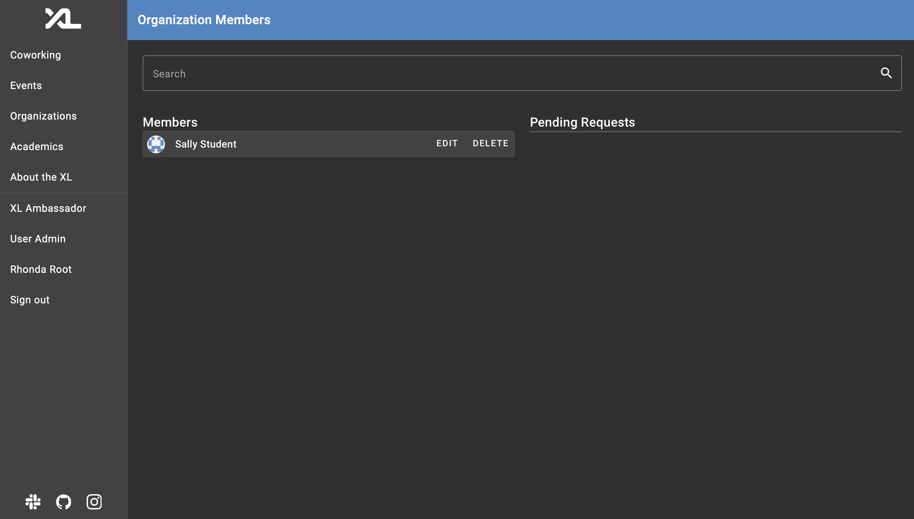

# Student Organization Member Management Technical Specifications

This document contains the technical specifications of the Student Organization Member Management feature.

# Authors

- [Hunter Hamrick](https://github.com/hhamrick)
- [Bennett Mangum](https://github.com/BennettM7)
- [Emmalyn Foster](https://github.com/emmalynfoster)
- [Albert He](https://github.com/albhe)

## How to Join and Leave an Organization

- In the sidebar menu, identify the organizations tab and click it.
- At the top of the organizations page, there will be two tabs, one to display all organizations in the Computer Science department, and another to display the organizations the user is a member of.
- Stay on the current tab and click the details button for an open organization you would like to join.
- A join button should appear for an organization that is open. Click the join button. You are now a member of the organization.
- To leave the organization, click the leave button.


This image shows the view from the Sally Student persona. The user is given a conveniently located join button in the details page of a specific organization.


This image shows the view from the Sally Student persona. The user is given a leave button that replaces the join button once the user joins the organization. The user can click this at any time to leave the organization.

## How to View This New Membership and/or All Memberships

- To view this new membership, click the organizations tab in the sidebar.
- Navigate to the My Organizations tab and click on it.
- The status or each organization that you have joined or attempt to join is displayed.


This image shows the view from the Sally Student persona. This user is given a tab that displays all of the organizations they are apart of. On this my organization card widget, information pertaining to when the organization was join is displayed. The role of the user in the organization is also displayed. In this case, the user is a member of CADS.


This iamge shows the view from the Larry Leader persona. Because this member is a leader, their title is displayed on the my organizations card in the my organizations tab. This allows them to clearly distinguish the different roles in their memberships.

## How to Manage Members as a Leader

- Navigate to the details page of an open or request based organization.
- Click the members button. You should all of the members in an organization, including pending members for organizations that are pending.
- Click the edit or delete buttons of organization members to edit or delete them.
- Click the accept or deny buttons of pending organization members for organizations that require a membership request to be made. If you click accept, this will add them to the organization as a member. If you click deny, this will remove them from the pending members list and reject their request to be a member of the organization.



This image shows the view from the Rhonda Root persona. Because this person is an admin, they have all of the permissions. In this case, the user can edit the members of any organization using the members page shown.

## How to Edit the Displayed Details of an Organization as a Leader

- Navigate to the organization details page.
- Click the edit button of the description editor.
- Enter your new description and click save.
- Your new description will appear.

## How to Update the Join Status Information of an Organization

- Navigate to the organzation details page.
- In the dropdown menu labeled "Status" select the join status you would like the organization to be updated to.
- Optionally, a link many be added.
- Click the update button to update the organization.


This image shows the view from the Rhonda Root persona. Because this person is an admin, they will have full access to all of the different aspects of an organization, including the ability to edit the join description, organization join status, and members.

## Descriptions and Sample Data Representations

There have been additions to the models and API routes to support the Student Organization Member Management feature:

```py3
class OrganizationMember(NewOrganizationMember):
   organization: Organization
   user: User
   role: MemberRole
   title: str
```

This model was added in the backend to represent the membership of a user regarding a specific organization. This membership is also assigns a default role when initially joining, which can later be changed with the appropriate action from an authorized leader or administrator.

```py3
class MemberRole(Enum):
   MEMBER = "MEMBER"
   LEADER = "LEADER"
   PENDING = "PENDING"
```

This enumeration was added in the backend to denote the role of an OrganizationMember. This is used to denote the role of a user in an organization as well as enforce any permissions the user may or may not have.

```py3
class OrganizationStatus(Enum):
   OPEN = "OPEN"
   APPLICATION_BASED = "APPLICATION BASED"
   CLOSED = "CLOSED"
```

This enumeration was added in the backend to denote the different statuses an organization can have. The open status means anyone can join. The application based status means users will need to request to be a member and be accepted in order to join an organization. The closed status means no members can join or request to join.

```py3
@api.get(
    "/{slug}/member",
    response_model=OrganizationMember | None,
    tags=["Organizations"],
)
def get_member(
    slug: str,
    user_id: int = -1,
    subject: User = Depends(registered_user),
    user_service: UserService = Depends(),
    organization_service: OrganizationService = Depends(),
) -> OrganizationMember | None:
    """
    Get a specific members for the given organization

    Parameters:
        slug: a string representing a unique identifier for an Organization
        user_id: an int id that is unique to the user
        subject: a valid User model representing the currently logged in User
        organization_service: a valid OrganizationService
    """

    if user_id == -1 and subject.id is not None:
        user: User = subject
    else:
        user: User = user_service.get_by_id(user_id)

    organization: OrganizationDetails = organization_service.get_by_slug(slug)
    return organization_service.get_member(subject, user, organization)


@api.get("/{slug}/members", response_model=list[PublicUser], tags=["Organizations"])
def get_organization_members(
    slug: str,
    pending: bool = False,
    subject: User = Depends(registered_user),
    organization_service: OrganizationService = Depends(),
) -> list[PublicUser]:
    """
    Get all members for given organization

    Parameters:
        slug: a string representing a unique identifier for an Organization
        pending: a bool representing if only pending members or no pending members
        subject: a valid User model representing the currently logged in User
        organization_service: a valid OrganizationService
    """

    organization: OrganizationDetails = organization_service.get_by_slug(slug)
    return organization_service.get_members(subject, organization, pending)
```

These additions were made to the organizations API. The get method at the top is used to retrieve a specific member in a specific organization. The second get method is used to retreive all of the members in a given organization. These are important for viewing and managing members in an organization.

```py3
@api.get(
    "/memberships/", response_model=list[Organization], tags=["Organizations"]
)
def get_user_memberships(
    user_id: int = -1,
    pending: bool = False,
    subject: User = Depends(registered_user),
    user_service: UserService = Depends(),
    organization_service: OrganizationService = Depends(),
) -> list[Organization]:
    """
    Get all memberships for registered user

    Parameters:
        user_id: an int representing the unique id for a User
        pending: a bool representing if only pending members or no pending members
        subject: a valid User model representing the currently logged in User
        user_service: a valid UserService
        organization_service: a valid OrganizationService
    """
    if user_id == -1 and subject.id is not None:
        user: User = subject
    else:
        user: User = user_service.get_by_id(user_id)

    return organization_service.get_organizations_from_member(subject, user, pending)
```

This API method is a GET method for getting all of the organizations a user is a member of. This is important for displaying the users memberships in the "My Organizations" tab.

```py3
@api.delete("/{slug}/members", response_model=None, tags=["Organizations"])
def remove_member_from_organization(
    slug: str,
    user_id: int = -1,
    subject: User = Depends(registered_user),
    user_service: UserService = Depends(),
    organization_service: OrganizationService = Depends(),
):
    """
    Remove registered user from organizagtion based on slug

    Parameters:
        slug: a string representing a unique identifier for an Organization
        user_id: an int representing the unique id for a User
        subject: a valid User model representing the currently logged in User
        user_service: a valid UserService
        organization_service: a valid OrganizationService
    """
    if user_id == -1 and subject.id is not None:
        user: User = subject
    else:
        user: User = user_service.get_by_id(user_id)

    organization: OrganizationDetails = organization_service.get_by_slug(slug)
    organization_service.delete_member(subject, user, organization)
```

This API method is a DELETE method that removes a user from an organization. This is important for managing members within an organization and allowing users to leave organizations.

```py3
@api.put("/members", response_model=OrganizationMember, tags=["Organizations"])
def update_member(
    member: OrganizationMember,
    subject: User = Depends(registered_user),
    organization_service: OrganizationService = Depends(),
):
    """
    Update organization member

    Parameters:
        member: a valid OrganizationMember
        subject: a valid User model representing the currently logged in User
        organization_service: a valid OrganizationService
    """
    return organization_service.update_member(subject, member)
```

This API method is a PUT method that updates a member in an organization. This is important for updating users within an organization.

```py3
@api.post("/{slug}/members", response_model=PublicUser, tags=["Organizations"])
def add_member_to_organization(
    slug: str,
    user_id: int = -1,
    subject: User = Depends(registered_user),
    user_service: UserService = Depends(),
    organization_service: OrganizationService = Depends(),
):
    """
    Add registered user to organization based on slug

    Parameters:
        slug: a string representing a unique identifier for an Organization
        user_id: an int representing the unique id for a User
        subject: a valid User model representing the currently logged in User
        user_service: a valid UserService
        organization_service: a valid OrganizationService
    """
    if user_id == -1 and subject.id is not None:
        user: User = subject
    else:
        user: User = user_service.get_by_id(user_id)

    organization: OrganizationDetails = organization_service.get_by_slug(slug)
    return organization_service.add_member(subject, user, organization)
```

This API method is a POST method that adds a user to an organization. This is important for allowing users to join organizations.

## Database/Entity-Level Representation Decisions

A many-to-many relationship was chosen between Users and Organizations so that a user can have many memberships to organizations and an organization can have many members. As a result, we have an entity that serves as a representation of the relationship database table. This entity is "class OrganizationMemberEntity(EntityBase):".

## Technical and User Experience Design Choices

Technical:

- To implement the roles and permissions for roles, we needed to decide on an implementation that could effectively distinguish between potential members and full members in a request-based organization. We ultimately decided to add the role for pending users waiting on a response to their join request due to it effectively providing the difference between the two categories of users for our feature without having to change or add the admin roles. To get the users who are actually full members of an organization, users with the role of 'pending' will be filtered out as they are potential future members of a club.
- To implement the organization status component of our feature, we decided to split the statuses up into "OPEN", "APPLICATION BASED", and "CLOSED". Because many organizations have their own applications processes and methods, this decision was put forward to be compatible with as many organizations as possible. Through these statuses, organizations can still use their own application process, while accepting and managing the members within the feature.

User Experience:

- For those with the proper authentication, the drop-down menu to update the type of organization was moved to be in the details page for ease of access. This way, we could keep the page structure more concise and easier to use as opposed to navigating to another page. Since the feature is only needed to be displayed once per organization, this decision was ultimately made for a cleaner user experience.
- An effort was put forth to organize this feature to be consistent with the existing organizations component. By creating a "My Organizations" tab, users can easily switch between all of the organizations and their own memberships. The welcome description, join button, and organization status editor were also put together on the details page where these features can be easily viewed and accessed. Because the page for managing members has the potential to require a significant amount of space, it was implemented as a separate page. Like the other features, this page can be accessed conveniently from the details page.

## Development Concerns: Guide/Tour of Files

A new developer can get started on this feature by visiting the following important files that provide an overview to the feature's implementation.

docs/student_orgs.md
This contains the initial design document and wireframes for the initial design. The personas and stories are also included.

frontend/src/app/organization/organization.model.ts

This is the organization model on the frontend.

frontend/src/app/organization/organization-page.component.css
frontend/src/app/organization/organization-page.component.html
frontend/src/app/organization/organization-page.component.ts

These files contain the implementation of the organization page that can be navigated to using the sidebar.

frontend/src/app/organization/organization-details.component.css
frontend/src/app/organization/organization-details.component.html
frontend/src/app/organization/organization-details.component.ts

These files contain the implementation of the organization details page that can be navigated to using the sidebar.

frontend/src/app/organization/organization-join-description-editor.component.css
frontend/src/app/organization/organization-join-description-editor.component.html
frontend/src/app/organization/organization-join-description-editor.component.ts

These files contain the implementation of the organization join description editor page that can be navigated to using the sidebar.

frontend/src/app/organization/organization-member-editor.component.css
frontend/src/app/organization/organization-member-editor.component.html
frontend/src/app/organization/organization-member-editor.component.ts

These files contain the implementation of the organization member editor page that can be navigated to using the sidebar.

frontend/src/app/organization/organization-members-page.component.css
frontend/src/app/organization/organization-members-page.component.html
frontend/src/app/organization/organization-members-page.component.ts

These files contain the implementation of the organization members page that can be navigated to using the sidebar.

frontend/src/app/organization/widgets

This folder contains the various widgets used throughout the organization component, including the join-card widget, organization-not-found widget, and more.

frontend/src/app/organization/widgets/my-organization-card

This folder contains the wigdet for the organizations under the my organizations tab.

frontend/src/app/organization/widgets/organzation-details-info-card

This folder contains the widget for displaying the details of an organization.

frontend/src/app/organization/widgets/organization-join-card

This folder contains the widget that displays a card which contains the join button for a user to join an organization.

frontend/src/app/organization/widgets/organization-join-status

This folder contains the widget that allows a leader to update the join status of an organization to be displayed when a user visits the details page.

frontend/src/app/organization/widgets/organization-member-card-widget

This folder contains the widget for showing the members of an organization.

frontend/src/app/organization/widgets/pending-request-widget

This folder contains the widget for showing the the pending requests of an organization.

frontend/src/app/organization/organization-page.service.ts

This is the frontend service for the organization component which calls the backend API to power the frontend components and widgets.

backend/api/organizations.py

This is the API in the backend that has methods for the organizations and the members of the organizations.

backend/services/organization.py

This is the backend service that is called by the API. This includes implementation for getting specific data from the backend to send back to the API.

backend/models/member_role.py

This file contains the possible roles a user can have with regards to an organization.

backend/models/organization_member.py

This file contains the Pydantic model used to represent a user's membership in an organization, as well as their role or pending status regarding that organization.

backend/entities/user_entitiy.py

This file contains the entity used to represent the user table in the database.

backend/entities/organization_member_entity.py

This file contains the entity used to represent the relational table between users and organizations in the database.

backend/entities/organization_entity.py

This file contains the entity used to represent the organization table in the database.
